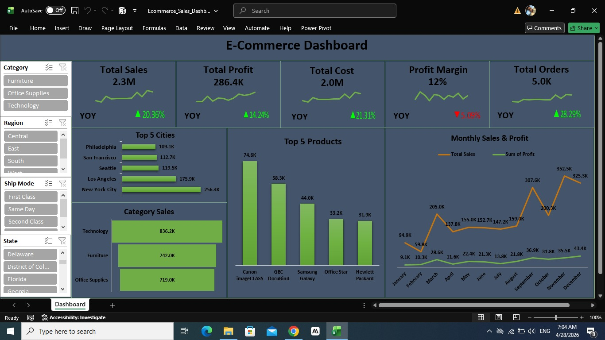

## E-Commerce Sales Dashboard using Excel

## Business Problem
This dashboard was developed to help analyze e-commerce sales performance and support data-driven decision-making. It provides insights into overall sales, profit, orders, and performance across different regions, categories, and time periods.

## Tools Used
Microsoft Excel (Pivot Tables, Pivot Charts, Slicers, KPIs, Formulas)

## Data Preparation
- Cleaned and structured raw sales data  
- Ensured data consistency and removed errors  
- Organized key fields such as Sales, Profit, Category, Region, and Order Date  

## Key Features
- Interactive dashboard using slicers (Category, Region, Ship Mode, State)  
- KPI metrics: Total Sales, Total Profit, Total Cost, Profit Margin, Total Orders  
- Year-over-Year (YoY) growth analysis  
- Top 5 Cities by Sales  
- Top 5 Products by Sales  
- Sales distribution by Category  
- Monthly Sales and Profit trends  

## Key Insights
- Sales show a strong increase during the last quarter of the year (Q4), especially in November and December  
- Profit does not always increase with sales, indicating the impact of discounts or higher costs  
- New York and Los Angeles are the top-performing cities in terms of sales  
- Technology category generates the highest sales among all categories  

## Recommendations
- Increase marketing efforts during high-performing months (Q4)  
- Focus on top-performing cities to maximize revenue  
- Review pricing and discount strategies to improve profitability  
- Invest more in high-performing categories such as Technology  

## Dashboard Preview

